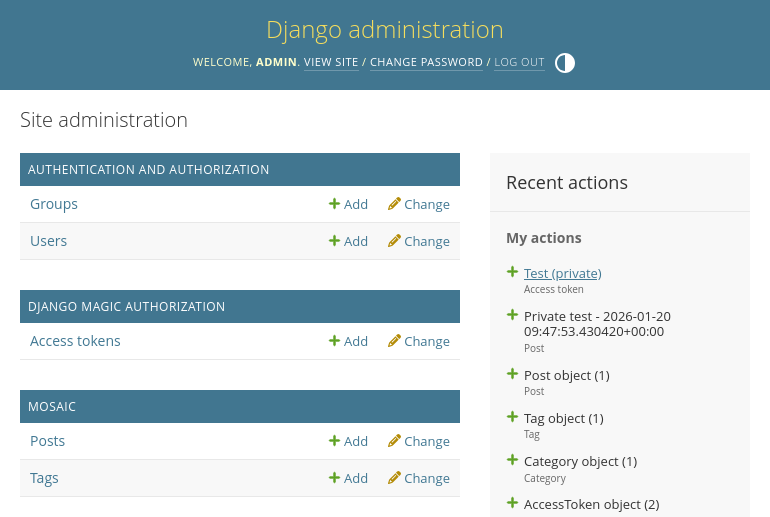
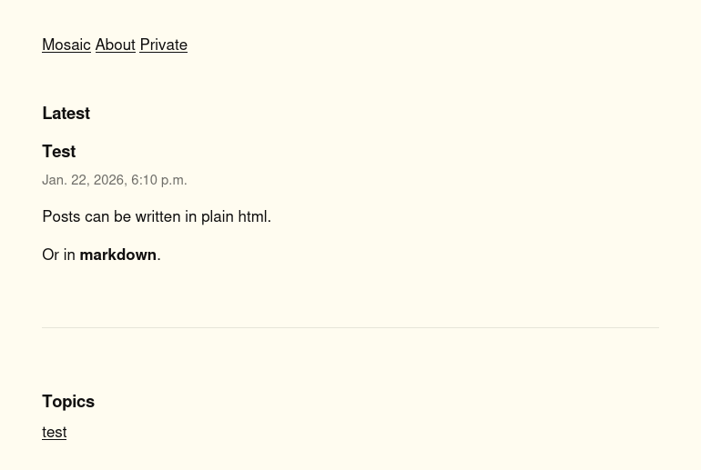

# Mosaic

A simple blog system in the spirit of the <a href="https://indieweb.org">IndieWeb</a>. It's aimed to get up and running as quickly as possible with your own, easily customizable CMS

## Installation

First, install the package using your favorite python package manager

```bash
uv add django-mosaic
```

or

```bash
pip install django-mosaic
```

Second, you need to enable the app in your Django project.

```python
# settings.py
INSTALLED_APPS = [
  ...
  "django_mosaic"
  ...
]
```

Third, run the migrations to add the relevant schemas to your database

```bash
uv run python manage.py migrate
```

## Quickstart

Start the development server.

```bash
uv run python manage.py runserver
```

Mosaic exposes all its features through the admin. First, create a user for the admin.

```bash
uv run python manage.py createsuperuser
```

Go to [http://localhost:8000/admin](http://localhost:8000/admin).



You can write a post right within the admin, in [markdown](https://daringfireball.net/projects/markdown/).


By default, there are two `namespace`s, `public` and `private`. Everything you post in `public` will be visible to, well, everyone. Posts in `private` will be visible only to those with a secret `AccessToken`, which you can also generate in the admin.

Only `Post`s with the `is_draft` flag set to `False` will be shown on your website.

Hit the save button and go to https://localhost:8000



Have fun!

## Deployment

To reduce one of the major pains of running your own site, Mosaic includes automated deployment for VPS hosting with sane (reach out if not!) defaults for Docker, nginx, and SSL certificates.

### Quick Deploy

Deploy to a fresh Ubuntu/Debian VPS:

```bash
uv run python manage.py mosaic deployment setup
```

The setup wizard will prompt you for:
- VPS hostname and SSH credentials
- Domain name
- Email for SSL certificate notifications

The deployment script will:
- Install Docker, nginx, and certbot
- Configure firewall (UFW)
- Build and deploy your application in a Docker container
- Set up nginx as a reverse proxy with rate limiting
- Obtain SSL certificates via Let's Encrypt
- Configure automated hourly database backups

### Check Deployment Status

```bash
uv run python manage.py mosaic deployment status
```

Shows health checks for services, SSL certificates, backups, and application availability.

### Configuration

Configuration is saved to `.deployment-config.toml` for subsequent runs.

