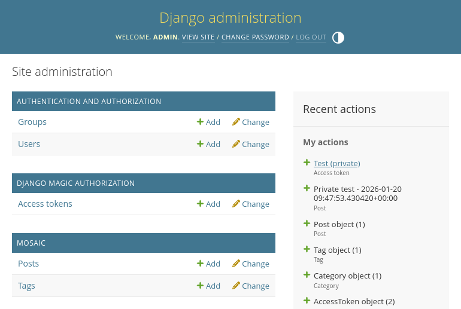
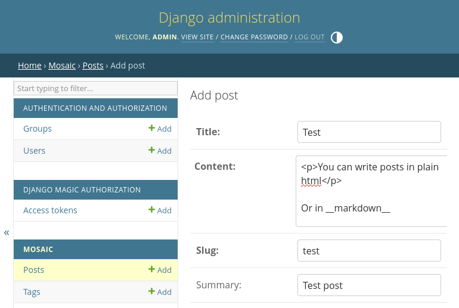
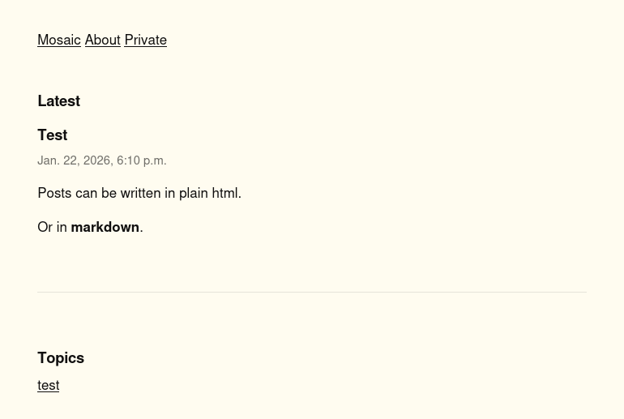

# Mosaic

A simple blog system in the spirit of the <a href="https://indieweb.org">IndieWeb</a>. It's aimed to get up and running as quickly as possible with your own, easily customizable CMS

## Installation

First, install the package using your favorite python package manager

```bash
uv add django-mosaic
```

or

```bash
pip install django-mosaic
```

Second, you need to enable the app in your Django project.

```python
# settings.py
INSTALLED_APPS = [
  ...
  "django_mosaic"
  ...
]
```

Third, run the migrations to add the relevant schemas to your database

```bash
uv run python manage.py migrate
```

## Quickstart

Start the development server.

```bash
uv run python manage.py runserver
```

Mosaic exposes all its features through the admin. First, create a user for the admin.

```bash
uv run python manage.py createsuperuser
```

Go to [http://localhost:8000/admin](http://localhost:8000/admin).



You can write a post right within the admin, in [markdown](https://daringfireball.net/projects/markdown/).



By default, there are two `namespace`s, `public` and `private`. Everything you post in `public` will be visible to, well, everyone. Posts in `private` will be visible only to those with a secret `AccessToken`, which you can also generate in the admin.

Only `Post`s with the `is_draft` flag set to `False` will be shown on your website.

Hit the save button and go to https://localhost:8000



Have fun!

## ATProto / ATmosphere (optional)

Mosaic can act as a bridge to the [AT Protocol](https://atproto.com): published
public posts sync to your PDS as [standard.site](https://standard.site)
documents with a companion Bluesky post, replies to that post render as your
comment section, and cross-app reactions (recommends, stars, favorites) are
counted via the Constellation backlink index. Your other ATProto content —
[Tangled](https://tangled.org) repositories, [BookHive](https://bookhive.buzz)
books, or any lexicon collection — can be rendered as pages on your site
straight from your repo, no local models needed.

Enable it by adding `django_mosaic.atproto` to `INSTALLED_APPS`, including
`django_mosaic.atproto.urls` at your project root, and configuring the
`MOSAIC_ATPROTO` setting (see `django_mosaic/atproto/conf.py` for all
options):

```python
MOSAIC_ATPROTO = {
    "HANDLE": "example.com",
    "APP_PASSWORD": os.environ["ATPROTO_APP_PASSWORD"],
    "PUBLICATION": {"NAME": "My Blog", "URL": "https://example.com"},
}
```

Customize collection pages (e.g. `/projects`) by overriding
`lexicons/<collection NSID>.html` — the same template-override mechanism as
the rest of mosaic. Drafts and the private namespace never leave your server.

## Deployment

To reduce one of the major pains of running your own site, Mosaic includes automated deployment for VPS hosting with sane (reach out if not!) defaults for Docker, nginx, and SSL certificates.

### Quick Deploy

Deploy to a fresh Ubuntu/Debian VPS:

```bash
uv run python manage.py mosaic deployment setup
```

The setup wizard will prompt you for:
- VPS hostname and SSH credentials
- Domain name
- Email for SSL certificate notifications

The deployment script will:
- Install Docker, nginx, and certbot
- Configure firewall (UFW)
- Build and deploy your application in a Docker container
- Set up nginx as a reverse proxy with rate limiting
- Obtain SSL certificates via Let's Encrypt
- Configure automated hourly database backups

### Check Deployment Status

```bash
uv run python manage.py mosaic deployment status
```

Shows health checks for services, SSL certificates, backups, and application availability.

### Configuration

Configuration is saved to `.deployment-config.toml` for subsequent runs.


## 🤖 AI Disclaimer

This project uses AI-assisted development tools. See the [AI usage policy](https://j23n.com/public/posts/2026/my-ai-policy) for details.

**Tools**

- Claude Code (Anthropic) · `claude-sonnet-4-6` · Agentic

### Contribution Profile

```
Phase                               Human│ AI
─────────────────────────────────────────┼───────────────
Requirements & Scope       95% ██████████│             5%
Architecture & Design      95% ██████████│             5%
Implementation             40%       ████│░░░░░░      60%
Testing                     5%           │░░░░░░░░░░  95%
Documentation              40%       ████│░░░░░░      60%
```

**Oversight**: Collaborative

Human and AI co-author decisions; human reviews all output.

### Process

AI agent operated autonomously across multi-step tasks. Human reviewed diffs, resolved conflicts, and approved merges.

### Accountability

The human author(s) are solely responsible for the content, accuracy, and fitness-for-purpose of this project.

---
*Last updated: 2026-02-20 · Generated with [ai-disclaimer](https://github.com/j23n/ai-disclaimer)*
